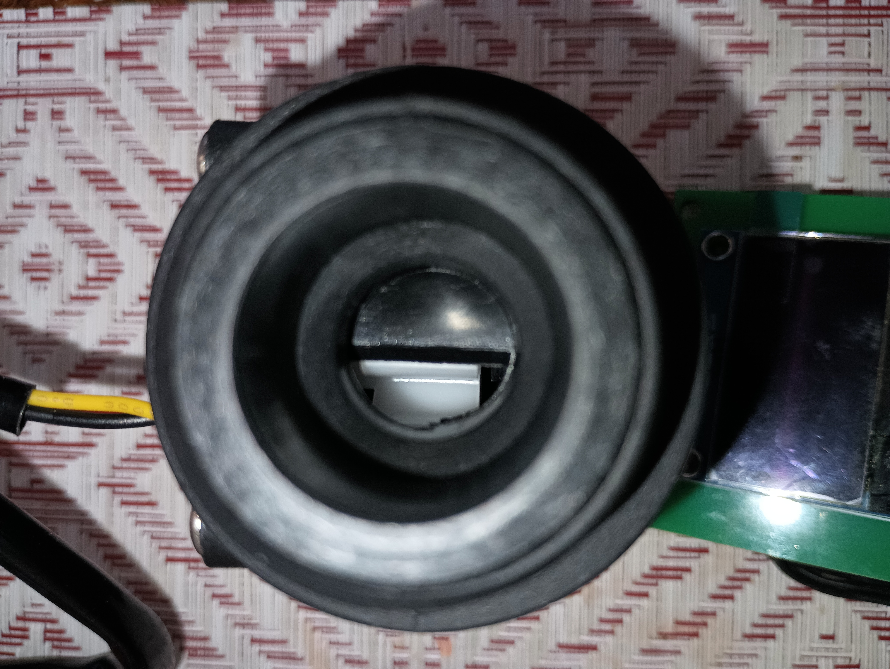
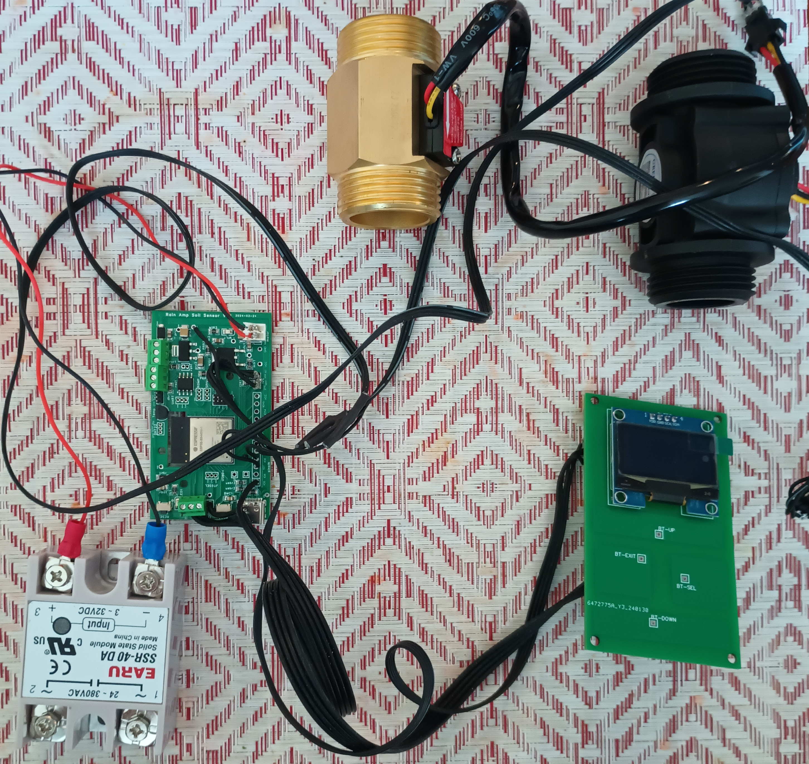

# water flow activated injector feed

Activate hydrogen peroxide injector feed pump when water is flowing through Hall effect based Gredia G1 water flow sensor.   Also provides water meter and GPM flow sensor for our filtered water.

## Overview
Our well water contains excessive levels of arsenic and iron, making it unsafe for gardening. To address this issue, we've implemented a system designed to reduce these contaminants to below EPA standards. By oxidizing the metals, we can transform them into a form that can be more effectively captured by our mechanical filtration system, allowing us to safely use the water for gardening purposes.   

We purchased a injector pump to inject hydrogen peroxide a powerful oxidizing agent.  This helps oxidize iron and arsenic before the water hits a 5 micron sediment filter then a green sand filter followed by a backwash style active carbon filter.  The early oxidization allows the green sand filter to remove more of the metals before it enters our downstream filter system.   

The water, now with reduced metal content, is then fed to the house after passing through a water softener and arsenic removal filter. By reducing the metallic contaminants, we're extending the lifespan of these filters, which can be quite expensive to replace.  

After installing the system, our original well pump failed and was replaced with a constant pressure pump. This change disrupted the power supply to the 110V injector pump. To conserve hydrogen peroxide, we've implemented a flow-based activation system. By monitoring the water flow into the filter system, we only activate the hydrogen peroxide pump when the filters are in operation. This significantly reduces our hydrogen peroxide consumption and costs since it runs about $36 per gallon.

Our lawn water is draw off the system before the filtration system and does not cause water to flow through the sensor or pre-filter system which helps conserve hydrogen peroxide.

## process
The CPU drives a low side switch which activates a SSA-40 DA solid state relay to switch AC hot line to injector pump whenever we have water flowing through 
sensors. 

We use a Gredia G1 measure water flow.  It is a uses a hall sensor to output pulses as a pelton style wheel turns as water flows through the unit

resistance through the sensors. That means we must compute flow through 
both sensors and add together to get total flow.   

Our hydrogen peroxide injector pump is not variable speed so we simply detect any flow greater than the minimum offset from the sensors and activate the pump.  To minimize pump wear we ensure the pump stays on for 30 seconds after water flow stops and stays off for at least 10 seconds.  
    * For the G1 the minimum detectable flow is 0.54 LPM while minimum 
      flow is 1.35LPM for the YB-B10. Both devices rate their flow detection
      G1 is rated for 1..60LPM   The YB-B10 is rated for 2..60LPM

Total Water and current gallons per minute are displayed on OLED display.  It permanently saves this once and hour so total is not lost after reboot.    It also computes GPM for each sensor and displays on OLED

Uses ESP32-s3 based RainAmp controller board but should work with any generic ESP32 module with minor pin changes Uses SH1106 1.3 inch OLED display over I2C for user interface.  Uses push buttons for Up, Down, Sel, Exit.  This board
supports RS485 on Uart-1 but it is not needed for this purpose 

# CPU Pins
* Pin LED - 11
* Pin Motor Enable - 16
* Pin SDA - 17
* Pin SCL - 18
* Pin meter water flow pulse sensor 1 - 7
* Pin meter water flow pulse sensor 2 - 8 
* VCC 3.3V to Sensor 1, sensor 2 and OLED.
* GND to sensor 1, sensor 2 and OLED
* Button support
    Buttons not used in Version 1 but were added to 
    face place and wired into CPU for when I find a
    need. 
    * pin button up - 1  - (reserved) 
    * pin button down - 2 - (reserved) 
    * pin button select -4  - (reserved) 
    * pin button exit  - 5 - (reserved) 
    * VCC through 47K resistor to each  buttons
    * 1M bleed resistor for each button to ground 

# Main Unit Wiring
* Power supply standard 3 prong plug to box. Wiring connected with standard wiring nuts. 
* Black wire from wall to 10 Amp Fuse holder to Both USB 5 volt supply and one pole of relay.
  * Black from Switched side Relay to Black wire lug on Receptacle Lug
* White from Wall to both USB 5 volt supply and Neutral Lug on receptacle Lug
* Green from wall to Ground Plug Lug on receptacle.

# 3D printed parts
* Faceplate for 3 Gang box - Special focus here was reserving room for 
  OLED supply,  outlet plug and Digital Relay.  I wanted the activation 
  LED for the relay to show through the face plate.  
* CPU holder mounted below relay
* qty 2 angled brackets to hang unit to wall stud.

## parts I used

* [Gredia G1 Hall effect water flow sensor](https://www.amazon.com/GREDIA-Sensor-Food-Grade-Flowmeter-Counter/dp/B07RF5D156/)  I used 2 sensors
* [3 gang box for assembly of entire unit](https://www.amazon.com/Madison-Electric-Products-MSB3G-Adjustable/dp/B00H8NUVQA)
* [Silicone ribbon cable to connect sensors OLED](https://www.amazon.com/MECCANIXITY-Ribbon-Silicone-Stranded-Tinned/dp/B0CBB3C91V)

* Face Plate for 3 Gang box -  3D printed - TODO: ADD Picture and 
  CAD drawing here.
    * QTY 2  6/32 by 1.5" machine screws - hold relay and cpu support to faceplate
    * Qty 6  #4 X 3/4" philips screw - connect faceplate to box
    * Qty 6   #4 X 1/2" philips screw - connect OLED to faceplate

* CPU board holder to mount CPU board below digital relay - TODO: Add picture 
  and CAD drawing here.

* [5v usb power supply 5V](https://www.amazon.com/Adapter-UorMe-Charger-Charging-Compatible/dp/B08LGRN2NR)  My board 
  accepts 5V to 40V in.  Other boards may need 3V power supply. This one was 
  small enough to keep inside the 3 gang unit.
* [1.3" OLED display](https://www.aliexpress.us/item/2251832498844654.html)
* [40 amp Digital Relay for AC](https://www.aliexpress.us/item/3256804475347699)
* [Recommended CPU](https://www.aliexpress.us/item/3256805991471052.html) I used a proprietary board I made for another purpose but this CPU would have done just as well.
* [Fuse holder for 10 amp fuse](https://www.amazon.com/KOLACEN-Automotive-Inline-5x20mm-Holder/dp/B071G1L98V) Installed on Live wire 
* Wall Plug Generic 3 prong 120V outlet
* 3 prong male plug to supply power
* 7 foot 3 conductor flexible wire for power supply cord

### Plumbing Parts
Our system is based on 1" pex so we need to adapt the single water 
pip to allow water to flow through both sensors in parallel then 
capture the water back into a single pipe.
* SKIPPED: 1" PEX 90 from water source
* SKIPPED: PEX T and PEX 90 to feed water to two sensors
* qty 1 -  1" Female NPT brass fittings to connect to sensors
* qty 1 G1 sensors with male 1" NPT 
* qty 1 - 1" Female NPT  brass fitting for other side sensors
* SKIPPED: Pex 90 and Pex T 
* SKIPPED: Pex 90 to feed water back into pipe
* Associated 1" Pex clamps  and Teflon tape for NPT connections.

## Recommended Changes  
* Use a 3.3V gate Triac such as [BTB06-600B](https://www.aliexpress.us/item/3256806576807703.html) in lieu of solid state relay.  The Triac is smaller and capable of carrying the current needed for this application.

* Make a new PCB with exact match for this use.
  * Add the triac direct to board with AC terminal lugs on board.  
  * Add AC input to DC 3.3V power supply direct on board in lieu of wall bud
  * For buttons Add pull up resistors with bleed and direct wire to CPU but make jumper selectable so can choose to use them for capacitive sense if needed.  
  * Consider adding fuse on board in-lieu of pigtail fuse.  These changes
would simplify wiring in the box. 
* Consider Use Circuit breaker with external reset button in lieu of inline fuse.

## Findings from First Week
* Having a connector that allows rapid disconnect of unit from power and pulse 
  sensor was very helpful allowing the unit to be easily removed and updated 
  without hauling computer out to the water shed. 

* CPU pin measuring output from Pulse sensors are picking up pulses from noise when 220V pump is activating.  This is triggering it to sense water flow that is not actually happening.  This caused over reporting of water use and pumping hydrogen peroxide when
using unfiltered water which was undesirable.  To resolve this issue:
  * Sensor wire proximity to pressure transducer or the wire from pump 
    controller to pump seem to put out a lot of noise. Moving the wires
    to keep the hall sensor signal wire away from those 2 removed 
    about 90% of the noise. This also means that attention should 
    be made when installing the flow sensor to keep it away from these
    wires.
  * Due to space limitations I only installed 1 G1 sensor.  The second 
    sensor if not plugged in to a sensor was generating errant pulses.
    fixed by disabling one of the sensors in software.
  * Modify flow detection to require a 2LPM flow rater.   The lower end 
    of the G1 resolution is around 1GMP so this should be adequate.  
    This helped but the errant pulses still triggered changes.
  * Modified the water flow detection logic to require water flow 
    for 15 continuous seconds before activating injector pump.
    Since the noise is not continuous **this eliminated nearly all 
    of undesirable injector pump operation.**
  * Next steps if needed:
    * Move signal sensor wire into a ground shielded cable 
    * Move main CPU as close as possible to flow sensor 
      and/or keep the wire between CPU and flow sensor 
      as short as possible. 
    * Add a resistor in range of 50K to 250K to ground on 
      sensor probe to help dampen noise from signal.
    * Move the flow sensor so it is much further away 
      from wires used by well pressure transducer and the 
      220V wires for the pump and controller.  ** This 
      would eliminate a majority of the problem **
    * Consider a very small CPU board mounted on the sensor
      with a RS485 signal to the main CPU mounted in the 
      main switch console.  This keeps the digital AC relay
      away from the sensor and would allow the sensor wire
      to CPU counter to be very short and the RS485 is very 
      resistant to local noise.  This would substantially 
      increase software complexity and parts cost.

## Things that Failed
* Current version of Arduino with ESP32 S3 mini used in this design does not properly route interrupts from touch sensors.  They can be read find using touchRead.  Decided to just use normal old buttons instead but turned out that didn't need any user input at least not so far.
  * Arduino Version: 2.3.2 Date: 2024-02-20T09:54:08.669Z CLI Version: 0.35.3 
  * ESP32 3.0.2 from Espressif
